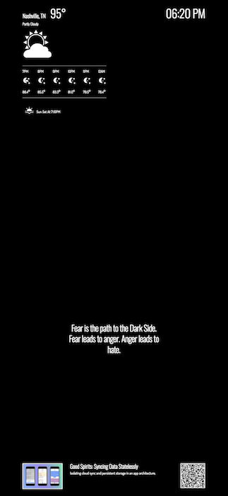

# Smart Mirror

## Web app for voice controlled smart mirror

### Components include

- Clock 
- Local Forecast
- Rotating Yoda Quotes (bc why not?)
- Rotating News Feed w/ Dynamic QR Code

### Available Voice Commands

| COMMANDS                     | DESCRIPTION                                                                           |
|------------------------------|---------------------------------------------------------------------------------------|
| "Show me commands"           | Show a list of all available voice commands                                           |
| "Show me news sources"       | Show a paginated list of available sources for the news feed                          |
| "Show me next"               | Go to next page while viewing paginated list of news sources                          |
| "Show me news from [source]" | Switch news feed to fetch from a different available source                           |
| "Go back"                    | Show the previous article from the news feed (timer is set to display for 30 seconds) |
| "Hello Yoda"                 | Skip to the next Yoda quote in the carousel                                           |
| "Hide All"                   | Hide all components                                                                   |
| "Show All"                   | Show all components                                                                   |

